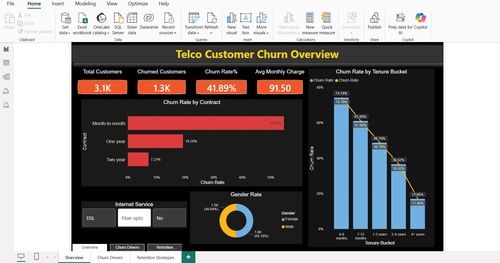
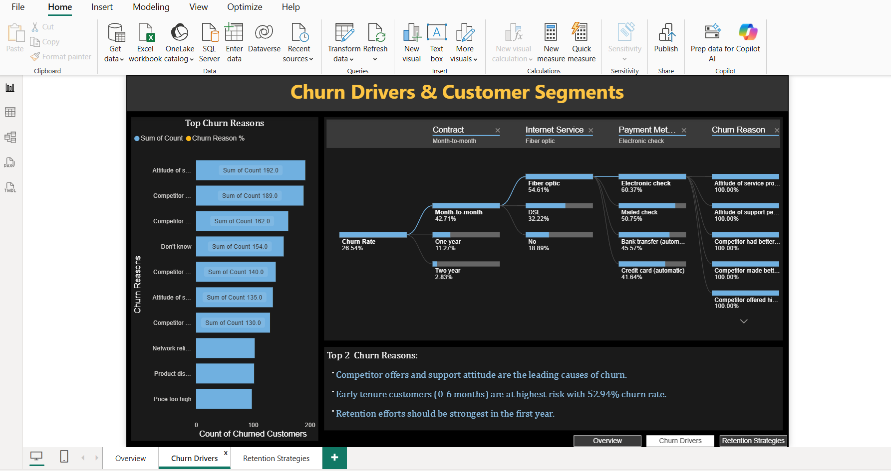
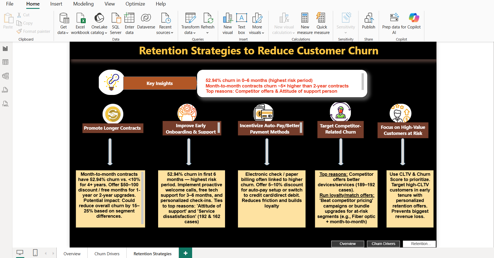

# Telco Customer Churn Analysis Dashboard

**Power BI| End-to-End Customer Retention Project**

**Live Dashboard**
https://app.powerbi.com/view?r=eyJrIjoiZTQ5OGY5M2UtMmM4Zi00MmQyLTliZWMtZWFjMDY5YmI4ZjJhIiwidCI6IjMxZDg4NTRiLTcxZTAtNDc1ZC1iOTY4LTdkYzE2MTE5N2RiNSJ9&pageName=f50b55b8c949f3d08ce9

## 📋 Project Overview
Developed an interactive **customer churn analysis dashboard**  
Analyzed **7,043 telco customers** to identify churn patterns, key drivers, and high-risk segments. Built actionable retention strategies directly linked to my **Amazon customer service experience** in handling escalations and building customer loyalty.

## 🎯 Key Insights
- Overall Churn Rate: **26.54%**
- Highest churn in **0-6 months** tenure: **52.94%**
- Month-to-month contracts churn at **42.71%** (vs ~3% for 2-year contracts)
- Top reasons: Competitor offers, Attitude of support person, Service dissatisfaction

## 🛠️ Tech Stack
- **Power BI** → Interactive Dashboard (4 pages)
- **SQL** → Data segmentation & aggregation
- **DAX** → Custom measures (Churn Rate, etc.)

## 📊 Dashboard Pages
1. **Overview** – KPIs + Contract-wise churn

2. **Churn Drivers & Segments** – Top reasons, Decomposition Tree, Tenure analysis

3. **Insights & Retention Strategies** – 5 data-driven recommendations

## 💡 Retention Strategies Highlight
- Promote longer contracts with discounts
- Strengthen early onboarding (first 6 months)
- Incentivize auto-pay
- Counter competitor offers
- Prioritize high-CLTV customers

## 📌 How This Connects to My Amazon Experience
In Amazon customer service, I handled complaints and escalations daily. This project allowed me to move from **reactive support** to **proactive retention** using data — identifying at-risk customers before they churn.

## 🚀 How to Use
1. Download the .pbix file or can interactive via live dashboard link shared above
2. Open `Telco_Customer_Churn_Dashboard.pbix` in Power BI Desktop
3. Explore the interactive slicers and drill-downs

 Feel free to star this repo if you find it useful!

 Open to feedback & opportunities**
